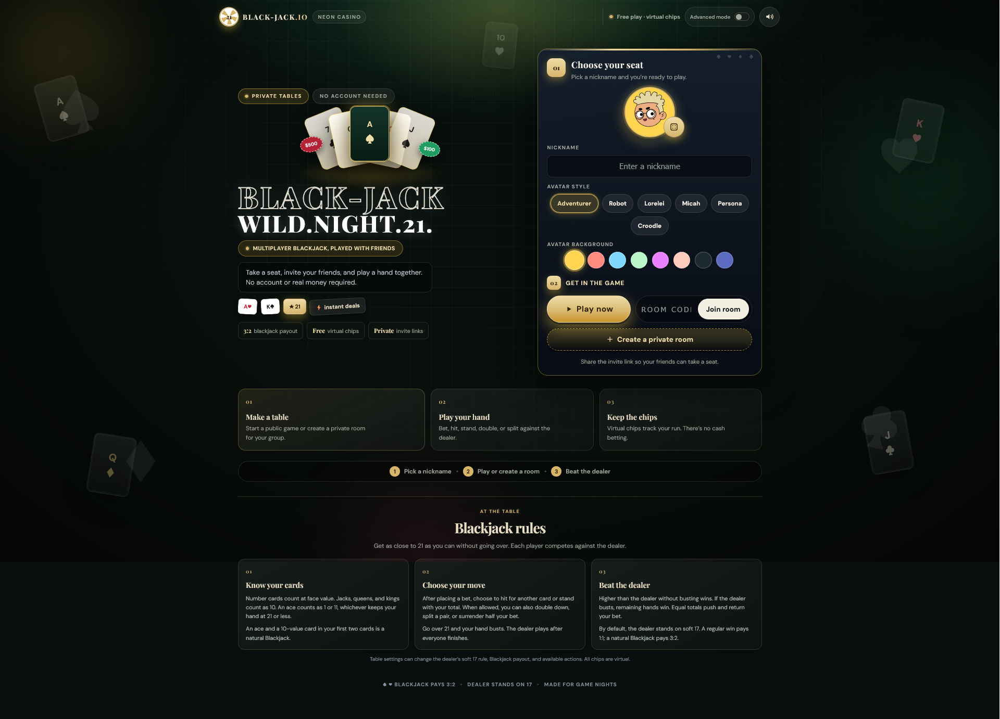

<div align="center">
  
  <h1>BLACK-JACK.IO</h1>
  <p>Multiplayer Blackjack, played with friends. No account, no real money, just virtual chips.</p>
  <p><a href="https://black-jack.abhishek-a.in"><strong>PLAY HERE</strong></a></p>
</div>



## Contents

- [About](#about)
- [How to play](#how-to-play)
- [Rules](#rules)
- [Liar's Table](#liars-table)
- [Table settings](#table-settings)
- [Tips for beginners](#tips-for-beginners)
- [FAQ](#faq)
- [Run it yourself](#run-it-yourself)
- [License](#license)

See [CHANGELOG.md](CHANGELOG.md) for what's new.

## About

Black-Jack.io is a real-time multiplayer Blackjack game that runs entirely in the browser.

- Play with friends at public tables or private rooms.
- Join with just a nickname and an avatar. Nothing to install.
- Live table with chat, betting, and all standard Blackjack moves.
- Virtual chips only, so every hand is risk-free.
- A second table in the house: **Liar's Table**, a bluffing card game with a Risk Chamber (see below).

## How to play

1. **Open the site** and enter a nickname. You can also restyle your avatar and its background color.
2. **Take a seat at a table:**
   - **Play now** drops you into a public table with a free seat.
   - Got an invite? Enter the **room code** and choose **Join room**.
   - Want your own game? Choose **Create a private room**, then share the invite link or room code with friends.
3. **Place your bet.** Tap chips to build your stake, then choose **Place bet**. The hand starts once everyone has bet or the timer runs out.
4. **Play your turn.** When the table reaches you, choose one of **Hit**, **Stand**, **Double**, **Split**, or **Surrender**. Some moves are only offered when your hand qualifies for them.
5. **Watch the dealer finish.** The dealer plays after all players, then winnings are paid out automatically.
6. **Play the rounds.** After the set number of rounds, the player with the most chips tops the table.

The host starts the game from the lobby and can tune the table before the first hand.

## Rules

### Goal

Score closer to 21 than the dealer without going over. You compete against the dealer, not against the other players at the table.

### Card values

| Cards | Value |
|---|---|
| 2 to 10 | Face value |
| Jack, Queen, King | 10 |
| Ace | 1 or 11, whichever keeps the hand at 21 or less |

An ace plus a 10-value card in your first two cards is a natural Blackjack, the strongest hand in the game.

### Your moves

| Move | What it does |
|---|---|
| Hit | Take another card. Go over 21 and the hand busts. |
| Stand | Keep your current total and end your turn. |
| Double down | Double the bet, take exactly one more card, then stand. |
| Split | With a pair, split into two hands that are played separately. |
| Surrender | Fold the hand early and get half the bet back. |

The dealer has no choices to make and always follows the table rule, by default standing on all 17s.

### Winning and payouts

| Outcome | Result |
|---|---|
| Your total beats the dealer | Win, paid 1:1 |
| Dealer busts | Every remaining hand wins |
| Same total as the dealer | Push, your bet is returned |
| Natural Blackjack | Paid 3:2 by default |
| Over 21 | Bust, the bet is lost |

## Liar's Table

A bluffing game for 2–4 players, played with an authentic 20-card Liar's Deck.

### The deck

6 Kings, 6 Queens, 6 Aces, plus 2 Jokers. Jokers are wild and always count as the table rank. Each player is dealt 5 cards.

### How a round works

1. The table names one rank — Kings, Queens, or Aces.
2. On your turn, lay **1–3 cards face-down** and declare them as the table rank. Truthfully or not.
3. The next player either calls **LIAR!** to challenge your claim, or lets it slide and lays their own cards.
4. A truthful claim sends the **challenger** to the Risk Chamber; a caught bluff sends the **liar**.
5. The chamber is 6 slots with 1 live by default (host can tune it). Survive and you take the pile; go out and you're eliminated.
6. Empty your hand and survive the challenge to win the table — or be the last one standing.

**Devil variant** (host toggle): one rank card is secretly marked 😈. It can only be played alone — but if anyone challenges it, *every other player* faces the chamber instead of just one.

Shortcuts: `L` calls LIAR!, `C` continues, `Enter` plays the selected cards. The bar has its own chat, emotes, avatar cast, and sound kit.

## Table settings

The host can configure each room before starting:

- Number of players, starting chips, and rounds.
- Betting and turn timers.
- Number of decks in the shoe.
- Dealer stands or hits on soft 17.
- Blackjack payout, 3:2 or 6:5.
- Which moves are allowed: double down, split, surrender, and strategy hints.

Defaults are 5 players, 1,000 starting chips, 8 rounds, a 6-deck shoe, 20-second timers, dealer stands on soft 17, and 3:2 Blackjack payouts.

## Tips for beginners

- Standing on 17 or higher is usually safer than chasing one more card.
- Doubling down is strongest when your total is 10 or 11 and the dealer shows a weak card.
- Splitting aces and eights is standard play. Think twice before splitting tens.
- Watch the dealer's upcard. A dealer showing 2 through 6 is more likely to bust.
- Turn on the strategy hint if the table allows it and treat it as a learning aid.

## FAQ

**Do I need an account?**
No. Pick a nickname and play.

**Is real money involved?**
No. All chips are virtual and reset every game.

**How do friends join me?**
Create a private room and send them the invite link or the room code shown in the lobby.

**What happens if someone leaves mid-hand?**
Their seat stays visible but their turn is skipped automatically. Empty tables close on their own.

**Why did my move button disappear?**
Moves are only offered when the rules allow them, for example splitting needs a pair and doubling needs enough chips.

## Run it yourself

Requirements: Node.js 18 or newer and npm.

```bash
git clone <repository-url>
cd black-jack
npm install
npm run dev
```

Then open the URL shown in the terminal (usually http://localhost:8787).

### End-to-end liar games

Scripted bots can play full Liar's Table games (normal and Devil rules) against a local dev server:

```bash
npm run dev          # in one terminal (http://localhost:8787)
CP=1.0 npm run e2e:liars devil   # in another: always-challenge Devil game
npm run e2e:liars normal         # normal rules
npm run e2e:blackjack            # full 2-round blackjack game
```

MIT. See [LICENSE](LICENSE).
